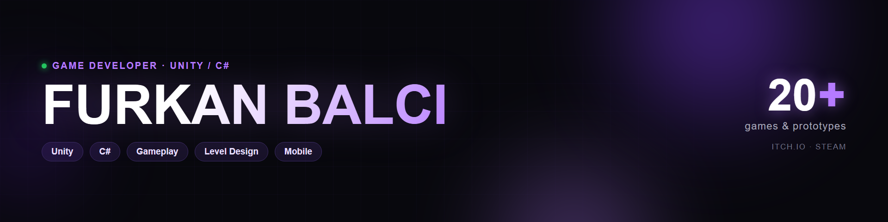

# Hi, I'm Furkan 👋

**Game Developer · Unity / C#** — Digital Game Design graduate from Istanbul Topkapı University.
I build gameplay mechanics and game systems in C#, with a growing focus on mobile.

- 🎮 20+ games & prototypes, 8 game jams, first places & awards
- 🕹️ Graduation game **Carry On Together** — heading to Steam
- 📱 Lately focused on **mobile game development & optimization**
- 🌐 Portfolio: **[furkanblci.github.io](https://furkanblci.github.io)**

### 🛠️ Tech & Tools

### 🚀 Featured Projects

| Project | What it is |
| --- | --- |
| **[Madness of the Science](https://store.steampowered.com/app/3207800)** | Story-driven 3D FPS · demo live on Steam (Pattern Games) |
| **Carry On Together** | Co-op party game · graduation project, heading to Steam |
| **[Soul Gate](https://lymite.itch.io/soul-gate)** 🏆 | 3D isometric action · Game Jam 1st place |
| **[Devil Journey](https://furkanbalci.itch.io/devil-journey)** 🏆 | 2D puzzle-platformer · Best Mechanic Design award |
| **[Stock Match](https://ibrahim-gumusdal.itch.io/udo-stock-match)** | Mobile triple-match puzzle · UDO Games internship |

➡️ **20+ games and more on [itch.io](https://furkanbalci.itch.io)**

### 🔗 Links

### 📊 GitHub Stats

